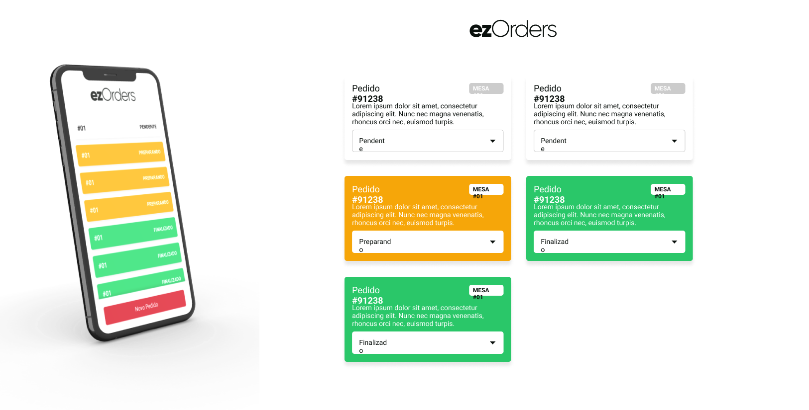

<h1 align="center">ezOrders</h1>

## 📝 Sobre
Aplicação para cadastro de pedidos, onde além de ser cadastrado o pedido também é possivel a alteração do status do pedido em tempo real tanto na aplicação web como na mobile.

## 💻 Tecnologias
- [React](https://pt-br.reactjs.org/)
- [React-Native](https://reactnative.dev/)
- [CSS](https://www.w3.org/Style/CSS/Overview.en.html)
- [Javascript](https://developer.mozilla.org/pt-BR/docs/Web/JavaScript)
- [NodeJs](https://nodejs.org/)

### Autor

 
<b>Elves Brito</b>

## ©️ Licença
Esse projeto está sob a licença MIT. verifique a página **LICENCE** para mais detalhes.

